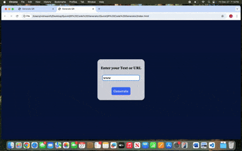

# QuickQR Generator

QuickQR Generator is a simple tool that allows users to quickly generate QR codes for any text or URL. The project is built using HTML, CSS, and JavaScript.

## Features
- Enter text or a URL to generate a QR code.
- Easy-to-use interface with a clean and responsive design.

## Preview

<div align="center">
    
</div>

## Demo GIF

<div align="center">
    
</div>

## How to Run the Project
1. Clone this repository:
   ```bash
   git clone https://github.com/vishwanth2001/QuickQR-Code-Generator
   ```
   
2. Open the index.html file in your browser to use the application.

## Technologies Used
HTML
CSS
JavaScript

## Usage
Enter text or a URL in the input field.
Click on the "Generate" button to create a QR code.
View or download the generated QR code.
